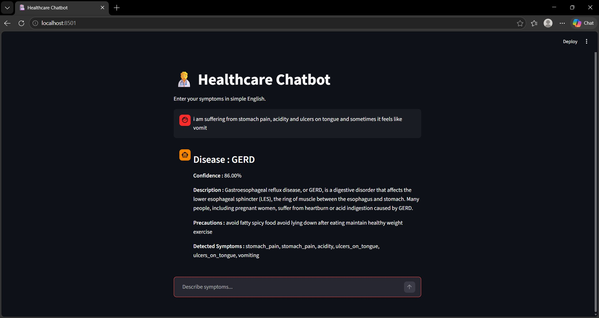

# Healthcare Chatbot using Machine Learning & Streamlit

## Project Overview
This project is a Healthcare Chatbot that predicts diseases based on user-input symptoms using a Machine Learning model (Random Forest Classifier).  
It converts natural language input into structured symptom data using a rule-based NLP approach, and displays predictions through an interactive Streamlit web interface.
## Features
- Disease prediction using RandomForestClassifier
- Rule-based symptom extraction from user input
- Confidence score for predictions
- Disease description & precautions
- Interactive chat interface using Streamlit

## Tech Stack
Python | Pandas | NumPy | Scikit-learn | Streamlit

## Workflow
### Step 1 : Data Collection
**Load datasets :**
- Training data
- Testing data
- Disease descriptions
- Disease precautions

### Step 2 : Data Preprocessing
Dataset is already structured (minimal cleaning required) 
Save processed data for reuse
**Output files :**
* `Training data.csv`
* `Testing data.csv`
* `Description data.csv`
* `Precautions data.csv`

### Step 3: Model Training (Random Forest)
**Split data into :**
X → Symptoms (features) 
y → Disease (target) 
Encode disease labels using LabelEncoder 
Train-test split (80% / 20%) 
Train model using RandomForestClassifier 
**Output files :**  
* `model.pkl`
* `label_encoder.pkl`
* `symptoms.pkl`

### Step 4: NLP Processing (User Input Handling)
**User input example :**  
I have fever and headache 
Convert text → lowercase 
**Match symptoms using :**  
direct matching (dataset symptoms) 
keyword mapping / fuzzy matching 
**Create symptom vector :** 
[0, 1, 0, 0, 1, ...]

### Step 5: Disease Prediction
Input → symptom vector  
Model predicts probability for each disease 
**Extract :**
Predicted disease, 
Confidence score  
**Fetch :**
Description, 
Precautions

### Step 6 : Streamlit UI (Frontend)
Chat-based interface  
User enters symptoms  
**System responds with Output :**
Predicted Disease, Confidence Score, Description, Precautions, Detected Symptoms

## Future Improvements
- Integrate advanced NLP (TF-IDF / BERT)
- Improve symptom extraction using ML models
- Deploy on cloud (AWS / GCP)
- Add user authentication & chat history

## Conclusion
This project builds a healthcare chatbot that predicts diseases from user symptoms using a Random Forest model and a Streamlit interface. It demonstrates an end-to-end ML pipeline with basic NLP for symptom extraction. While effective for simple inputs, it can be further improved using advanced NLP techniques.
